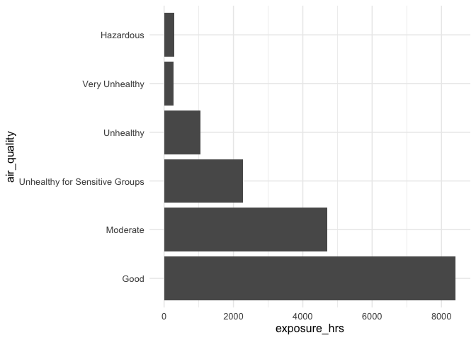

Manuscript - Malawi Hospital Air Quality Data - Notebook
================

# Introduction

The purpose of this document is to perform some initial exploratory data
analysis for air quality data from Malawi. Based on this analysis,
in-depth analysis will be performed and publication ready figures can be
produced.

# Data

Air quality data (PM2.5 and PM10) was collected in roughly 5-minute
intervals from eight locations at one hospital over the period of 3
months. The locations are 6B, Administration, guardian, Lhouse, Lions,
Malaria, MJC, and Moyo.

One sensor was installed at each location, either on the side or on the
outside wall.

# Data Exploration

TODO List:

-   24 hour average (**DONE**)
-   baseline (not the two peaks) (**not started**)
-   Hourly average (**DONE**)
-   Exposure in categories of hazard (**DONE**)
-   Peaks over 500 a day (**DONE**)
-   Difference between indoor and outdoor sensors (**not started**)
-   Ratios PM10 / PM25 (differences by location) (**WIP**)

## Plot: Overview

## Plot: Daily 24-hour average by date

## Plot: Daily 24-hour average (rolling)

TODO

## Plot: Hourly average by date and location

## Plot: Exposure in hours in categories of hazard

## Table: Peaks over twice the limit for hazardous

-   Peak for PM2.5: 2 x 250.4 = 500.8
-   Peak for PM10: 2 x 424.9 = 849.8
-   Column peaks counts the number of data points above these two limits
    over all days

| indicator | location       | peaks |
|:----------|:---------------|------:|
| pm10      | 6B             |     0 |
| pm10      | Administration |     0 |
| pm10      | guardian       |     0 |
| pm10      | Lhouse         |     0 |
| pm10      | Lions          |     0 |
| pm10      | Malaria        |     0 |
| pm10      | MJC            |     0 |
| pm10      | Moyo           |     0 |
| pm2.5     | 6B             |     3 |
| pm2.5     | Administration |     0 |
| pm2.5     | guardian       |   110 |
| pm2.5     | Lhouse         |   517 |
| pm2.5     | Lions          |     0 |
| pm2.5     | Malaria        |    13 |
| pm2.5     | MJC            |    27 |
| pm2.5     | Moyo           |    27 |

## Plot: Ratio between PM10 and PM2.5 range from minimum to maximum (WIP)

-   Calculation: PM10/PM2.5
-   Each line shows the minimum and maximum per day after calculating
    the average ratio per hour

