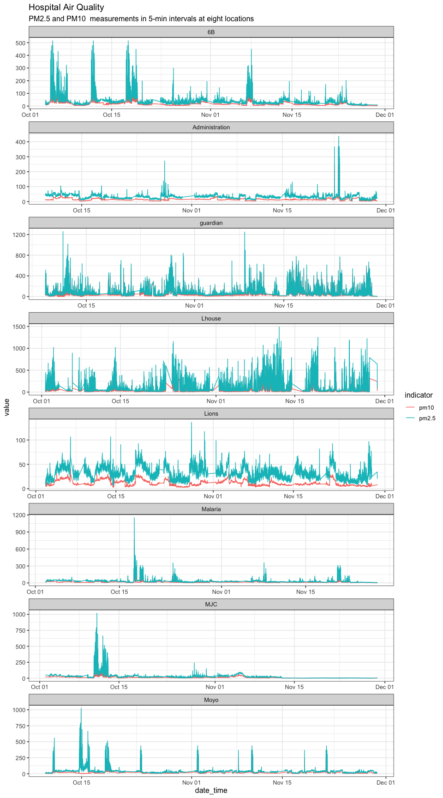
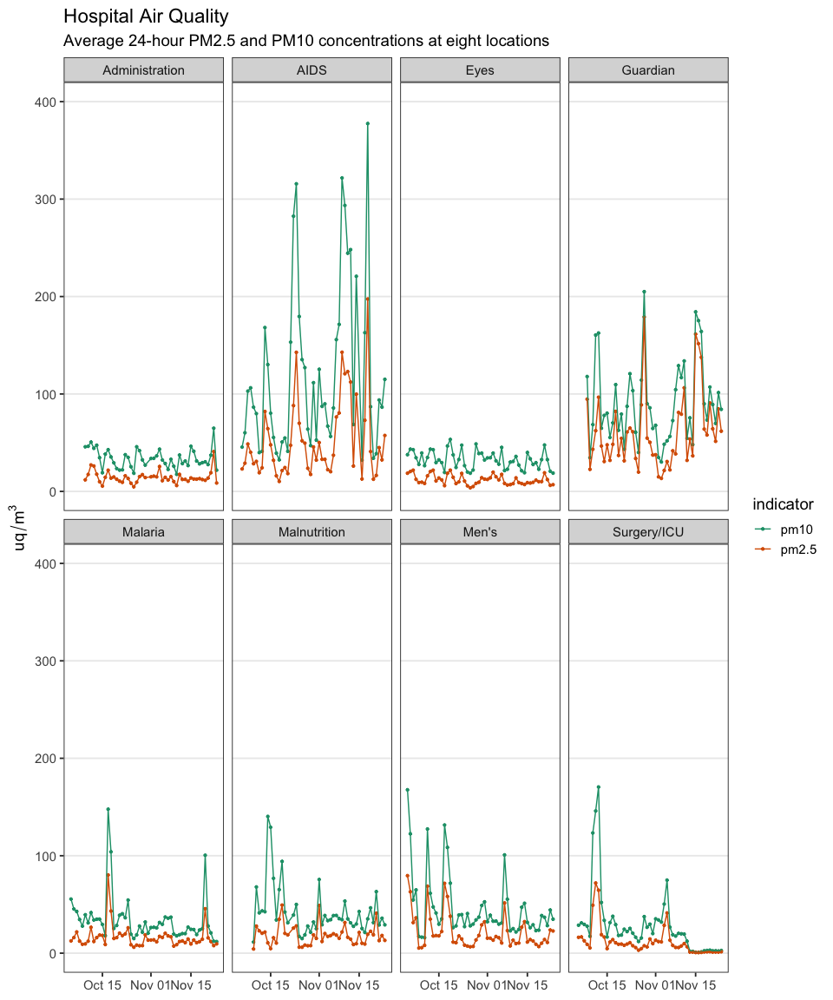
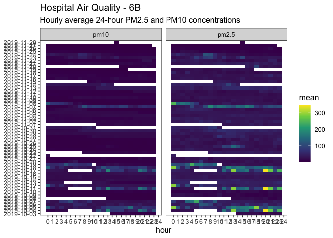
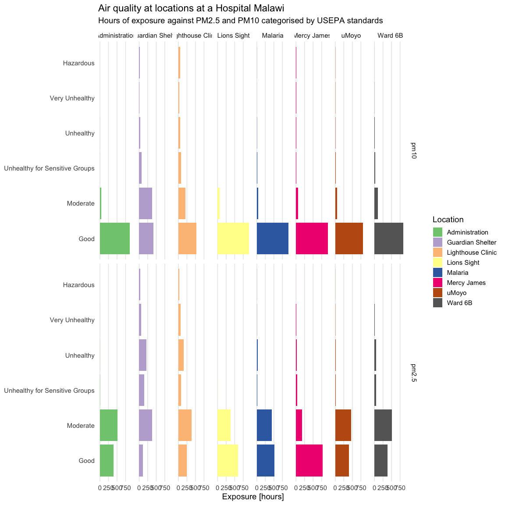
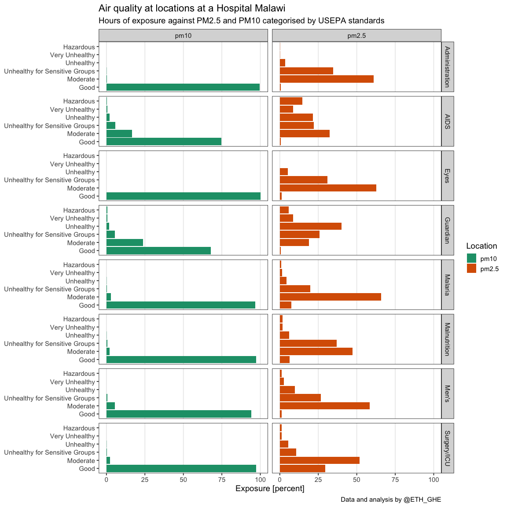
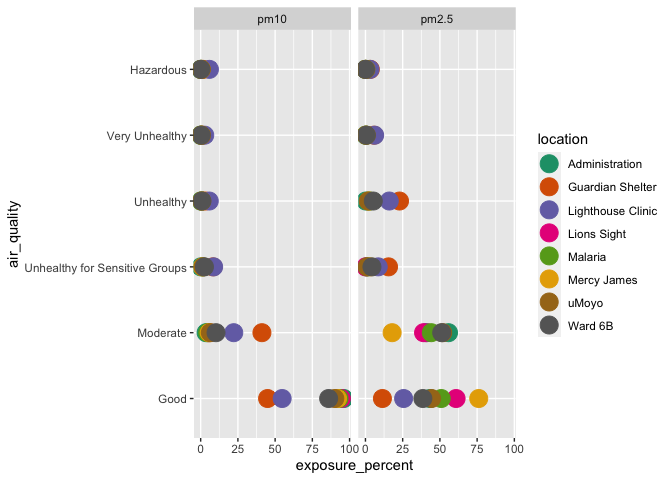
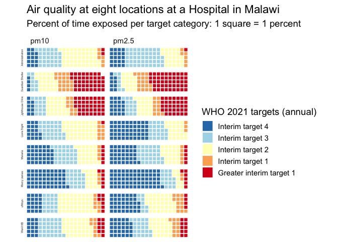
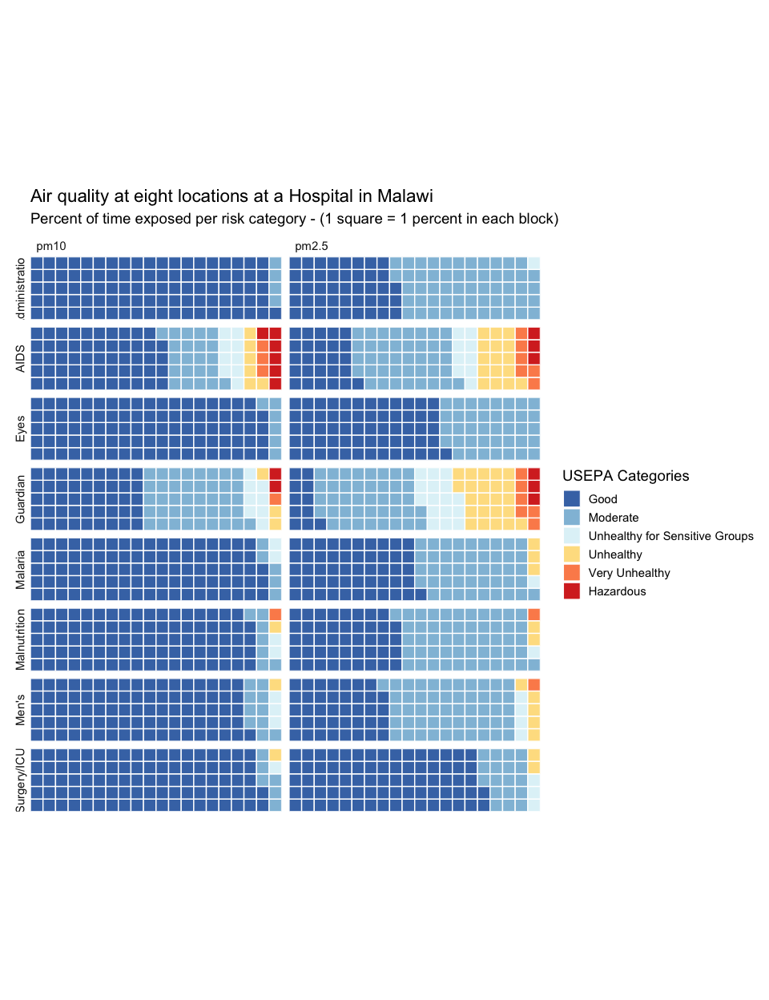
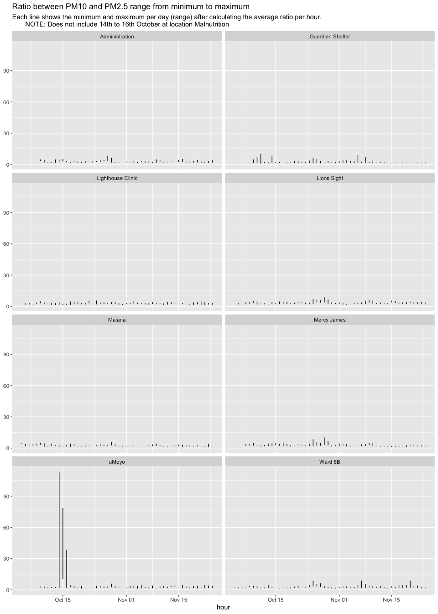
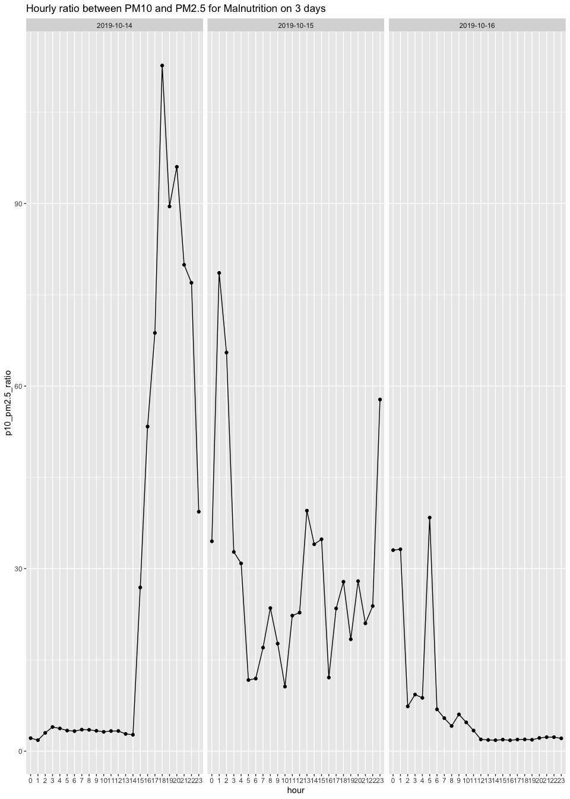

Manuscript - Malawi Hospital Air Quality Data - Notebook
================

# Introduction

The purpose of this document is to perform some initial exploratory data
analysis for air quality data from Malawi. Based on this analysis,
in-depth analysis will be performed and publication ready figures can be
produced.

# Data

Air quality data (PM2.5 and PM10) was collected in roughly 5-minute
intervals from eight locations at one hospital over the period of 3
months. The locations are Administration, AIDS, Eyes, Guardian, Malaria,
Malnutrition, Men’s, and Surgery/ICU.

One sensor was installed at each location, either on the side or on the
outside wall.

## Hospital locations

-   6B—&gt;Men’s Ward
-   guardian→ Guardian’s shelter (guardians of patients)
-   Lhouse—&gt;AIDS
-   Lions→ Eyes
-   Malaria—&gt;Malaria
-   MJC → Pediatric Surgery/ICU
-   Moyo —&gt;Malnutrition

## Sensor locations

-   Guardian Shelter, Ward 3b, Mercy James, and Lighthouse are outside,
    the rest would be inside

# Data Exploration

TODO List:

-   24 hour average (**DONE**)
-   baseline (not the two peaks) (**not doing**)
-   Hourly average (**DONE**)
-   Exposure in categories of hazard (**DONE**)
-   Peaks over 500 a day (**DONE**)
-   Difference between indoor and outdoor sensors (**not started**)
-   Ratios PM10 / PM25 (differences by location) (**WIP**)
-   Day time vs night time averages (6-18, 18-6) (**DONE**)

## Plot: Overview (Appendix)

## Plot: Daily 24-hour average by date

-   Is MJC 0 after 13th November?
-   WHO limits are 24-hour averages

## Plot: Day time vs night time averages (6-18, 18-6)

<!-- -->

## Plot: Exposure in hours in categories of hazard

### Totals (discarded)

### Percent (discarded)

### New plot 1 (discarded)

<!-- -->

### Waffle plot - \[@worldhealthorganization2021who\]

<!-- -->

### Waffle plot (selected) - USEPA

## Table: Peaks over the limit for hazardous

-   Peak for PM2.5: 2 x 250.4 = 500.8
-   Peak for PM10: 2 x 424.9 = 849.8
-   Column peaks counts the number of data points above these two limits
    over all days

| location       | pm10 | pm2.5 |
|:---------------|-----:|------:|
| Administration |    1 |     4 |
| AIDS           |  676 |   350 |
| Eyes           |    0 |     0 |
| Guardian       |  178 |   359 |
| Malaria        |   18 |    19 |
| Malnutrition   |   43 |    18 |
| Men’s          |   15 |     4 |
| Surgery/ICU    |   37 |    15 |

## Plot: Ratio between PM10 and PM2.5 range from minimum to maximum (WIP)

-   Calculation: PM10/PM2.5
-   Each line shows the minimum and maximum per day after calculating
    the average ratio per hour

### Plot: Hourly ratio between PM10 and PM2.5 for Malnutrition on 3 days

### Table: Hourly ratio between PM10 and PM2.5 for Malnutrition on 3 days

-   PM10 significantly rises (by tenfold) during these three days
-   PM25 descreases at the same time
-   The ratio jumps from to 90 from the usual 1 to 5

| date       | hour | location     | pm10 | pm2.5 | p10\_pm2.5\_ratio |
|:-----------|-----:|:-------------|-----:|------:|------------------:|
| 2019-10-14 |    0 | Malnutrition |   38 |    18 |                 2 |
| 2019-10-14 |    1 | Malnutrition |   31 |    17 |                 2 |
| 2019-10-14 |    2 | Malnutrition |   39 |    13 |                 3 |
| 2019-10-14 |    3 | Malnutrition |   41 |    10 |                 4 |
| 2019-10-14 |    4 | Malnutrition |   41 |    11 |                 4 |
| 2019-10-14 |    5 | Malnutrition |   37 |    11 |                 3 |
| 2019-10-14 |    6 | Malnutrition |   40 |    12 |                 3 |
| 2019-10-14 |    7 | Malnutrition |   44 |    12 |                 4 |
| 2019-10-14 |    8 | Malnutrition |   45 |    13 |                 4 |
| 2019-10-14 |    9 | Malnutrition |   45 |    14 |                 3 |
| 2019-10-14 |   10 | Malnutrition |   46 |    14 |                 3 |
| 2019-10-14 |   11 | Malnutrition |   44 |    13 |                 3 |
| 2019-10-14 |   12 | Malnutrition |   40 |    12 |                 3 |
| 2019-10-14 |   13 | Malnutrition |   53 |    19 |                 3 |
| 2019-10-14 |   14 | Malnutrition |   59 |    22 |                 3 |
| 2019-10-14 |   15 | Malnutrition |  145 |     5 |                27 |
| 2019-10-14 |   16 | Malnutrition |  302 |     6 |                53 |
| 2019-10-14 |   17 | Malnutrition |  386 |     6 |                69 |
| 2019-10-14 |   18 | Malnutrition |  438 |     4 |               113 |
| 2019-10-14 |   19 | Malnutrition |  354 |     4 |                90 |
| 2019-10-14 |   20 | Malnutrition |  374 |     4 |                96 |
| 2019-10-14 |   21 | Malnutrition |  294 |     4 |                80 |
| 2019-10-14 |   22 | Malnutrition |  287 |     4 |                77 |
| 2019-10-14 |   23 | Malnutrition |  162 |     4 |                39 |
| 2019-10-15 |    0 | Malnutrition |  204 |     6 |                34 |
| 2019-10-15 |    1 | Malnutrition |  258 |     3 |                79 |
| 2019-10-15 |    2 | Malnutrition |  266 |     4 |                66 |
| 2019-10-15 |    3 | Malnutrition |  121 |     4 |                33 |
| 2019-10-15 |    4 | Malnutrition |  114 |     4 |                31 |
| 2019-10-15 |    5 | Malnutrition |   47 |     4 |                12 |
| 2019-10-15 |    6 | Malnutrition |   39 |     3 |                12 |
| 2019-10-15 |    7 | Malnutrition |   69 |     4 |                17 |
| 2019-10-15 |    8 | Malnutrition |   81 |     3 |                24 |
| 2019-10-15 |    9 | Malnutrition |   66 |     4 |                18 |
| 2019-10-15 |   10 | Malnutrition |   64 |     6 |                11 |
| 2019-10-15 |   11 | Malnutrition |   87 |     4 |                22 |
| 2019-10-15 |   12 | Malnutrition |   85 |     4 |                23 |
| 2019-10-15 |   13 | Malnutrition |  119 |     3 |                40 |
| 2019-10-15 |   14 | Malnutrition |  102 |     3 |                34 |
| 2019-10-15 |   15 | Malnutrition |  121 |     3 |                35 |
| 2019-10-15 |   16 | Malnutrition |   99 |     8 |                12 |
| 2019-10-15 |   17 | Malnutrition |  159 |     7 |                23 |
| 2019-10-15 |   18 | Malnutrition |  167 |     6 |                28 |
| 2019-10-15 |   19 | Malnutrition |  134 |     7 |                18 |
| 2019-10-15 |   20 | Malnutrition |  168 |     6 |                28 |
| 2019-10-15 |   21 | Malnutrition |  109 |     5 |                21 |
| 2019-10-15 |   22 | Malnutrition |  124 |     5 |                24 |
| 2019-10-15 |   23 | Malnutrition |  304 |     5 |                58 |
| 2019-10-16 |    0 | Malnutrition |  215 |     7 |                33 |
| 2019-10-16 |    1 | Malnutrition |  210 |     6 |                33 |
| 2019-10-16 |    2 | Malnutrition |  165 |    22 |                 7 |
| 2019-10-16 |    3 | Malnutrition |  134 |    14 |                 9 |
| 2019-10-16 |    4 | Malnutrition |   99 |    11 |                 9 |
| 2019-10-16 |    5 | Malnutrition |  255 |     7 |                38 |
| 2019-10-16 |    6 | Malnutrition |   48 |     7 |                 7 |
| 2019-10-16 |    7 | Malnutrition |   36 |     7 |                 5 |
| 2019-10-16 |    8 | Malnutrition |   36 |     9 |                 4 |
| 2019-10-16 |    9 | Malnutrition |   41 |     7 |                 6 |
| 2019-10-16 |   10 | Malnutrition |   40 |     9 |                 5 |
| 2019-10-16 |   11 | Malnutrition |   41 |    12 |                 3 |
| 2019-10-16 |   12 | Malnutrition |   47 |    24 |                 2 |
| 2019-10-16 |   13 | Malnutrition |   51 |    28 |                 2 |
| 2019-10-16 |   14 | Malnutrition |   48 |    27 |                 2 |
| 2019-10-16 |   15 | Malnutrition |   45 |    24 |                 2 |
| 2019-10-16 |   16 | Malnutrition |   39 |    22 |                 2 |
| 2019-10-16 |   17 | Malnutrition |   44 |    23 |                 2 |
| 2019-10-16 |   18 | Malnutrition |   38 |    20 |                 2 |
| 2019-10-16 |   19 | Malnutrition |   36 |    19 |                 2 |
| 2019-10-16 |   20 | Malnutrition |   45 |    21 |                 2 |
| 2019-10-16 |   21 | Malnutrition |   46 |    20 |                 2 |
| 2019-10-16 |   22 | Malnutrition |   41 |    18 |                 2 |
| 2019-10-16 |   23 | Malnutrition |   36 |    17 |                 2 |

## Plot: Hourly average by date and location

Not included in paper.

